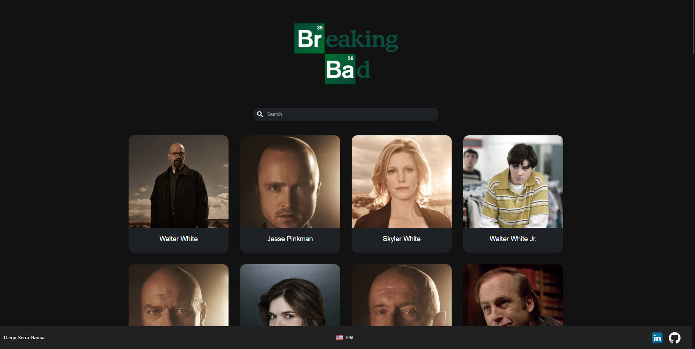

# General info

This project consists of an application with which you can consult the details of the characters of the series Breaking Bad using the api [breakingbadapi.com](https://www.breakingbadapi.com/).



For a full demo this application is hosted by [https://nervous-fermat-3644a3.netlify.app](https://nervous-fermat-3644a3.netlify.app/) using [Netlify platform](https://www.netlify.com/)

# Table of contents
- [Technologies](#technologies)
- [Setup](#setup)
  * [Available Scripts](#available-scripts)
    + [`npm start`](#-npm-start-)
    + [`npm test`](#-npm-test-)
    + [`npm test:coverage`](#-npm-test-coverage-)
    + [`npm run build`](#-npm-run-build-)
    + [`npm run eject`](#-npm-run-eject-)
- [Folder structure](#folder-structure)
- [State management](#state-management)
  * [CharactersSlice](#charactersslice)
  * [CharacterSlice](#characterslice)
  * [LanguageSlice](#languageslice)
  * [SettingSlice](#settingslice)
- [Hooks](#hooks)
- [Internationalization](#internationalization)
- [Http interceptor](#http-interceptor)
- [Testing](#testing)
- [Things to consider](#things-to-consider)

# Technologies

This project was bootstrapped with [Create React App](https://github.com/facebook/create-react-app) and [Craco](https://github.com/gsoft-inc/craco/tree/master/packages/craco) and using the technologies:

* [Typescript](https://www.typescriptlang.org/) as a strongly typed programming language that builds on JavaScript,
* [MUI](https://mui.com/) as a React UI library
* [Tailwind](https://tailwindcss.com/) as a utility CSS framework
* [React Redux](https://react-redux.js.org/) for application state management
* [Axios](https://axios-http.com/) to facilitate all kinds of operations as an HTTP client

For more libraries and utilities used in this project, you can check the [package.json](package.json)

# Setup

To run this project, install it locally using npm:
```
$ cd ../atSistemas
$ npm install
$ npm start
```

## Available Scripts

In the project directory, you can run:

### `npm start`

Runs the app in the development mode.\
Open [http://localhost:3000](http://localhost:3000) to view it in the browser.

The page will reload if you make edits.\
You will also see any lint errors in the console.

### `npm test`

Launches the test runner in the interactive watch mode.\
See the section about [running tests](https://facebook.github.io/create-react-app/docs/running-tests) for more information.

### `npm test:coverage`

Launches the test runner and generate a coverage report in [coverage folder](coverage/index.html).

### `npm run build`

Builds the app for production to the `build` folder.\
It correctly bundles React in production mode and optimizes the build for the best performance.

The build is minified and the filenames include the hashes.\
Your app is ready to be deployed!

See the section about [deployment](https://facebook.github.io/create-react-app/docs/deployment) for more information.

### `npm run eject`

**Note: this is a one-way operation. Once you `eject`, you can’t go back!**

If you aren’t satisfied with the build tool and configuration choices, you can `eject` at any time. This command will remove the single build dependency from your project.

Instead, it will copy all the configuration files and the transitive dependencies (webpack, Babel, ESLint, etc) right into your project so you have full control over them. All of the commands except `eject` will still work, but they will point to the copied scripts so you can tweak them. At this point you’re on your own.

You don’t have to ever use `eject`. The curated feature set is suitable for small and middle deployments, and you shouldn’t feel obligated to use this feature. However we understand that this tool wouldn’t be useful if you couldn’t customize it when you are ready for it.

# Folder structure
```sh
src
  ├───@breakingbad     # Core of the application
  │   ├───components
  │   ├───configs
  │   ├───context
  │   ├───hooks
  │   ├───services
  │   ├───types
  │   └───utils
  ├───environments    # Environments configuration
  ├───styles          # Global styles
  └───views           # Pages (Landing, Character detail, Error pages)
```

# State management

This project consists of 4 slices for the management of the different states of the application */src/@breakingbad/context/**


## CharactersSlice
Slice that retrieves the information of all characters returned by the breakingbad api and does a filtering based on a given searchText. 

```ts
const charactersSlice = createSlice({
	name: 'characters',
	initialState: charactersAdapter.getInitialState({
		searchText: ''
	}),
	reducers: {
		setCharactersSearchText: {
			reducer: (state, action: PayloadAction<string>) => {
				state.searchText = action.payload;
			},
			prepare: (event) => ({ payload: event.target.value || '' })
		}
	},
	extraReducers: (builder) => {
    builder
			.addCase(getCharacters.fulfilled, charactersAdapter.setAll)
			.addCase(getCharacters.rejected, charactersAdapter.removeAll)
  },
});
```

## CharacterSlice
This slice is responsible of handling the information of a specific character, making Http calls based on an id given to the name of a character.

```ts
export const getCharacter = createAsyncThunk('character/getCharacter', 
  async (id: number): Promise<CharacterType> => await getCharacterById(id));

export const getRandomQuote = createAsyncThunk('character/getRandomQuoteByAuthor', 
  async (name: string): Promise<QuoteType | undefined> => await getRandomQuoteByAuthor(name));

export const getDeath = createAsyncThunk('character/getDeath', 
  async (name: string): Promise<DeathType | undefined> => await getDeathByAuthor(name));
```

> **_NOTE:_**   **getCharacter** could have been used by calling **charactersSlice** based on the id, since in this breakingbad api, the call to /api/characters returns the same information as /api/characters/{id}.

```ts
const charactersAdapter = createEntityAdapter({
	selectId: (character: CharacterType) => character.char_id
});
```

## LanguageSlice
Responsible for managing the language of the application to configure the current language of the i18n library for internationalisation.

```ts
export const initialState: LanguageType = {
  settings: {
    language: languageFromStorage || Languages.default,
  },
  loadingI18n: false
};
```
This slice retrieves the language from the browser based on the i18nextLng key

## SettingSlice

This slice is very useful to set up a multi-theme, based on methods coming from material-ui. Currently the application only has the dark theme, but using this slice, it would be easily configurable to add a new theme in the [themesConfig](./src/@breakingbad/configs/themesConfig.ts) file and select it using this selector.

```ts
const themesConfig: ThemeConfig = {
	defaultDark: {
		palette: {
			type: 'dark',
			text: darkText,
			primary: primaryDark,
			secondary: {
				light: primary[100],
				main: primary[500],
				dark: primary[900]
			},
			background: {
				paper: '#1E2125',
				default: '#121212'
			},
			error: red
		}
	}
};
```

# Hooks
This project has two custom hooks which allows to control basic functionalities such as [scrolling](./src/@breakingbad/hooks/useScroll.ts) and [timeout](./src/@breakingbad/hooks/useTimeout.ts).

# Internationalization

The application uses the [i18next](https://www.i18next.com/) library to control the internationalisation, having as available the Spanish and English languages, defined in the files [es.json](./src/@breakingbad/utils/Internationalization/locales/es/es.json) and [en.json](./src/@breakingbad/utils/Internationalization/locales/en/en.json) respectively.

By default, the language of the application is defined by the language of the browser or english if i18next can't get this information

Using the [languageSlice](#languageslice), it is possible to change the language of the application on the fly, thus changing all preloaded literals to the requested language.

```ts
export const changeLanguage = (lng: Languages) => {
  dispatch(i18nloading());

  backInstance.changeLanguage(lng)
  .then(() => {
    dispatch(setLanguage(lng));
    dispatch(i18nloaded());
  })
};
```

# Http interceptor

To manage the different responses to Http calls, a wrapper has been created which, depending on the error status returned by the call response, informs the user of the error on the screen.

```js
export const injectInterceptor = (enqueueSnackbar: (message: SnackbarMessage, options?: OptionsObject | undefined) => SnackbarKey) => {
  Http.responseInterceptor(
    (res: AxiosResponse<any>) => res,
    async (err: any) => {
      
      if (axios.isCancel(err)) {
        return Promise.reject()
      };

      try {
        switch (err.response.status) {
          case (400):
          case (500):
          case (504):
            enqueueSnackbar(t(`error.${err.response.status}`), snackbarOptions);
            return Promise.reject(err);
          default:
            break;
        }
      } catch (e) {
        enqueueSnackbar(t(`error.504`), snackbarOptions);
      }
    }
  );

}
```
> **_NOTE:_**  This interceptor includes the most common error states, as these are the ones that the breaking bad api would return

# Testing

Using [jest](https://jestjs.io/), 4 tests of the different parts of the application have been included to show possible examples of how the tests of different parts of the project could be carried out..
- [App.spec.tsx](src/App.spec.tsx) - Main component and in charge of rendering the loading while the application loads the routes.
- [Character.spec.tsx](src/views/Character/Character.spec.tsx) - Component rendering the detail view of a character
- [character.spec.tsx](src/@breakingbad/services/Character/character.spec.tsx) - Service responsible for http calls to the /characters api
- [charactersSlice.spec.tsx](src/@breakingbad/context/characters/charactersSlice.spec.tsx) - Slice responsible for managing characters state

# Things to consider

This application takes into account that the number of characters returned by the breaking bad api is not high, so it has not been considered necessary to implement lazy loading, client virtualisation or infinite scroll.